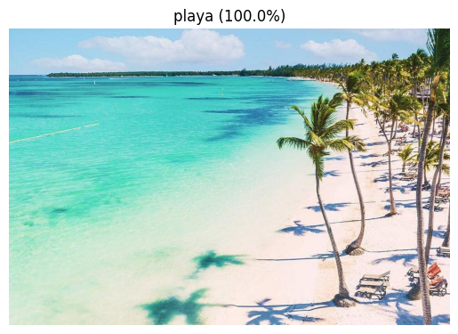
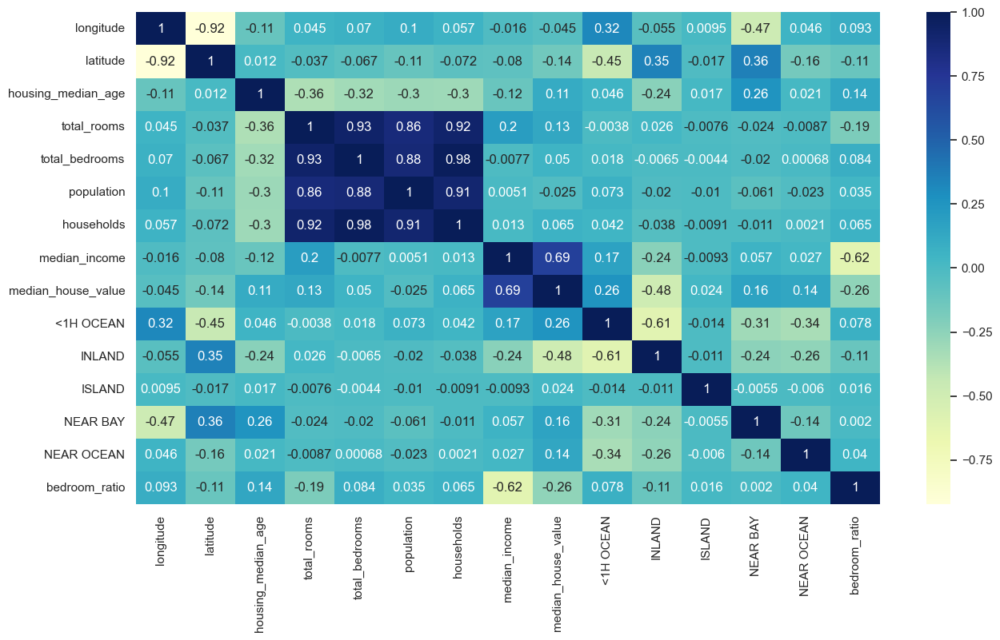
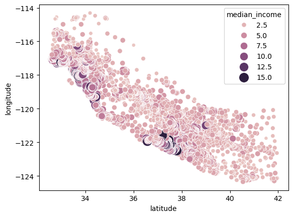
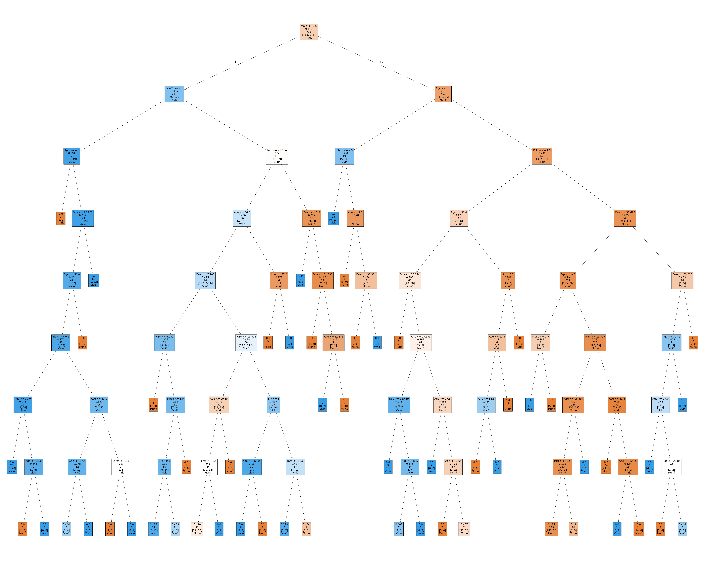
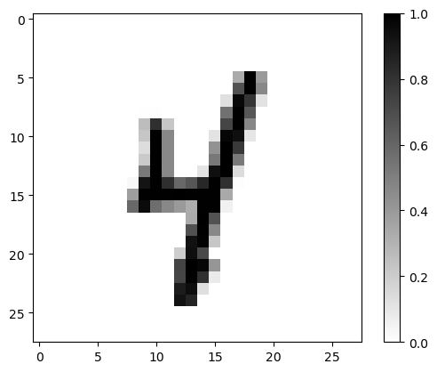
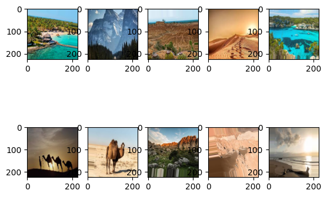

# Python - Inteligencia Artificial y Machine Learning

Repositorio de apuntes, ejemplos y ejercicios prácticos desarrollados durante un curso de Inteligencia Artificial con Python. Recorre el camino desde los algoritmos clásicos de *Machine Learning* (regresión, árboles de decisión, SVM, K-Means) hasta redes neuronales profundas, redes convolucionales y transferencia de aprendizaje, y culmina con un **proyecto final**: un clasificador de paisajes con interfaz gráfica.

<p align="center">
  
</p>

---

## Contenido

| Unidad | Tema | Notebook / script |
|--------|------|-------------------|
| U4 | Exploración de sets de datos | [U4_02_Sets de datos.ipynb](Ejemplos/Algoritmos/U4_02_Sets%20de%20datos.ipynb) |
| U4 | Regresión lineal (precios de vivienda en California) | [U4_03_Ejercicio de Regresion Lineal.ipynb](Ejemplos/Algoritmos/U4_03_Ejercicio%20de%20Regresion%20Lineal.ipynb) |
| U4 | Regresión logística | [U4_05_Regresion Logistica.ipynb](Ejemplos/Algoritmos/U4_05_Regresion%20Logistica.ipynb) |
| U4 | Árboles de decisión (supervivencia del Titanic) | [U4_06_Arboles de Decision.ipynb](Ejemplos/Algoritmos/U4_06_Arboles%20de%20Decision.ipynb) |
| U5 | Máquinas de soporte vectorial (SVM) | [U5_01_SVMs.ipynb](Ejemplos/Algoritmos/U5_01_SVMs.ipynb) |
| U5 | Clusterización con K-Means | [U5_03_Clusterizacion K Means.ipynb](Ejemplos/Algoritmos/U5_03_Clusterizacion%20K%20Means.ipynb) |
| U6 | Primera red neuronal (Celsius → Fahrenheit) | [U6_02_Primera Red Neuronal.ipynb](Ejemplos/temperatura/U6_02_Primera%20Red%20Neuronal.ipynb) |
| U6 | Red de clasificación de dígitos (MNIST) | [U6_03_Red de Clasificacion.ipynb](Ejemplos/Algoritmos/Redes%20Neuronales/U6_03_Red%20de%20Clasificacion.ipynb) |
| U6 | Red neuronal convolucional (MNIST) | [U6_04_Red Neuronal Convolucional.ipynb](Ejemplos/Algoritmos/Redes%20Neuronales/U6_04_Red%20Neuronal%20Convolucional.ipynb) |
| U6 | Prueba de un clasificador perros vs. gatos | [probar_modelo.py](Ejemplos/Algoritmos/Redes%20Neuronales/probar_modelo.py), [probar_modelo2.py](Ejemplos/Algoritmos/Redes%20Neuronales/probar_modelo2.py) |
| U6 | Transferencia de aprendizaje con KerasHub (bichofué vs. oso de anteojos) | [U6_05_Transferencia_Aprendizaje_KerasHub.ipynb](Ejemplos/Algoritmos/Redes%20Neuronales/Transferencia%20de%20aprendizaje/U6_05_Transferencia_Aprendizaje_KerasHub.ipynb) |
| Ejercicio | Modelo de peso vs. altura (población colombiana) | [Modelo Peso Altura.ipynb](Ejercicios/Altura_Peso/Modelo%20Peso%20Altura.ipynb) |
| Proyecto | Clasificador de paisajes: playa, desierto y montaña | [trabajo_final_IA.ipynb](Proyecto%20curso/trabajo_final_IA.ipynb) |

---

## Galería

### Algoritmos clásicos

<table>
  <tr>
    <td align="center"><br><sub>Matriz de correlación — Regresión lineal</sub></td>
    <td align="center"><br><sub>Ingreso medio por ubicación — K-Means</sub></td>
  </tr>
  <tr>
    <td align="center" colspan="2"><br><sub>Árbol de decisión — Supervivencia en el Titanic</sub></td>
  </tr>
</table>

### Redes neuronales

<table>
  <tr>
    <td align="center"><br><sub>Dígito manuscrito (MNIST) — Red convolucional</sub></td>
    <td align="center">
      
      <br>
      <sub>Imágenes de prueba — Transferencia de aprendizaje</sub>
    </td>
  </tr>
</table>

---

## Proyecto final: clasificador de paisajes

Modelo de visión por computadora entrenado con **transferencia de aprendizaje** que clasifica imágenes en *playa*, *desierto* o *montaña* (más una clase "ninguna de las anteriores"). Incluye una aplicación de escritorio con **Tkinter** ([app_clasificador_paisajes.py](Proyecto%20curso/app_clasificador_paisajes.py)) que permite cargar una imagen y ver la predicción junto con una gráfica de confianza por clase.

<p align="center">
  
</p>

<p align="center">
  
  
  
</p>

Para ejecutar la aplicación:

```bash
cd "Proyecto curso"
python app_clasificador_paisajes.py
```

---

## Tecnologías

- **Python 3.10**
- **TensorFlow / Keras** y **KerasHub** — redes neuronales y transferencia de aprendizaje
- **scikit-learn** — algoritmos clásicos de ML
- **pandas**, **NumPy** — manipulación de datos
- **Matplotlib**, **Seaborn** — visualización
- **Pillow**, **Tkinter** — procesamiento de imágenes e interfaz gráfica

## Configuración del entorno

Se recomienda un entorno conda con soporte GPU. En [Comandos Python IA.txt](Comandos%20Python%20IA.txt) se encuentran los comandos completos; resumen:

```bash
conda create -n tf-gpu python=3.10 -y
conda activate tf-gpu
pip install numpy==1.26.4 tensorflow==2.15.1 tensorflow-hub==0.16.1
pip install matplotlib pillow scipy pandas seaborn scikit-learn
```

> **Nota:** el dataset `cats_and_dogs_filtered` no se incluye en el repositorio por su tamaño.
